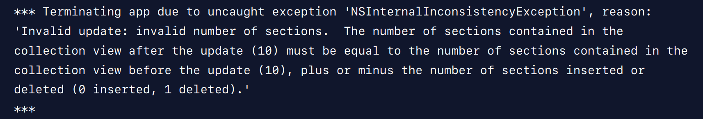

Diffable Data Source is a new declarative API for `UITableView` and its counterpart `UICollectionView` introduced at WWDC19, IOS 13 as a replacement for `UITableViewDataSource` and `UICollectionViewDataSource`. 

In this article we will take a brief look at `UITableViewDataSource` then we will go directly to the new API and see how it works with an example. 


### UITableViewDataSource


Previously, when working with `UITableView` or `UICollectionView` you would implement `UITableViewDataSource` protocol providing the table view with the details of how to display cells and supplementary views ( headers and footers ) and what data you want to render.
```swift
// Providing number of Rows and Sections
func tableView(UITableView, numberOfRowsInSection: Int) -> Int
func numberOfSections(in: UITableView) -> Int
// Providing Cells, Headers, and Footers
func tableView(UITableView, cellForRowAt: IndexPath) -> UITableViewCell
func tableView(UITableView, titleForHeaderInSection: Int) -> String?
func tableView(UITableView, titleForFooterInSection: Int) -> String?
// other datasource methods
```
whenever the models managed by the controller changes, you would normally reload the whole table view with `reloadData()` or `performBatchUpdates(_:completion:)` to update (insert, delete, move) only specific items or sections, doing something like : 
```swift
self.tableView.performBatchUpdates({
    self.tableView.deleteRows(at: deletedIndexPaths, with: .fade)
    self.tableView.insertRows(at: insertedIndexPaths, with: .right)
}, completion: nil)
```

But you need to be careful when getting the changes occurred and make sure the changes applied in the right order.
Otherwise when updates go wrong, you will get something like:




> Although `UITableViewDataSource ` approach is simple and flexible but it is also error prone and a common source of bugs and crashes when there is misalignment between the current UI state and the models managed by the controller. 

### Diffable data source

Now with the `UITableViewDiffableDataSource` you can create datasource and apply the changes between states in more safe way in terms of snapshots that represent the current state ( rendered models ) of the table view.
To display or update the the data you just create an object of `NSDiffableDataSourceSnapshot` with the updated data and provide it to the data source through calling its `apply(_:animatingDifferences:)` method that will compare the current displayed snapshot ( rendered models ) with the new applied snapshot to get the differences then apply and animate those changes.

## Getting Started 
Now let's see an example of a contacts list screen with a search bar allowing the user to search his contacts by name.

As we mentioned, with the new approach we just need two types
+ `UITableViewDiffableDataSource` that has two generic types: Section type and item type, telling the table view how to display cells and supplementary views.
+ `NSDiffableDataSourceSnapshot<SectionIdentifierType, ItemIdentifierType>` : that represent a new or updated UI state  to be displayed.

### Create the model
Let's start by building our model which is a Contact that will be displayed in a table view cell.

``` Swift
struct Contact : Hashable {
  
  var id = UUID()
  var firstName: String
  var lastName: String
  var emailAddress: String

  func hash(into hasher: inout Hasher) {
    hasher.combine(id)
  }
  
  static func == (lhs: Contact, rhs: Contact) -> Bool {
    lhs.id == rhs.id
  }
}
```
> Note : Diffable data source requires the two generic types `SectionIdentifierType ` and `ItemIdentifierType` ( model ) to be Hashable, allowing the data source to perform diffing between different snapshots ( compare different UI States to know exactly what has been inserted, deleted or moved )

### Setting up the data source

First let's create our Section type that will be used as SectionIdentifierType, containing two sections:

```swift
enum Section : Int , CaseIterable {
    case friendsContacts
    case allContacts
}
```

Then we create and configure our diffable data source that will provide that table view with details of how to display cells and supplementary view ( section headers and footers ).

```swift
typealias DataSource = UITableViewDiffableDataSource<Section, Contact>
private lazy var dataSource = makeDataSource()
// ...
func makeDataSource() -> DataSource {
    let dataSource = DataSource(tableView: tableView, cellProvider: {( tableView, indexPath, contact) -> UITableViewCell? in

        let cell = tableView.dequeueReusableCell(withIdentifier: ContactTableCell.reuseIdentifier, for: indexPath) as? ContactTableCell
        cell?.configure(with: contact)
        return cell
    })
    return dataSource
}
```

>Note : That you would normally do by implementing `cellForRowAt`, `titleForHeaderInSection` and so on with the `UITableViewDataSource`

### Creating a Snapshot

Now the table view knows exactly how to display data (models) and at this point we need to provide the table view with the data to be displayed.
This is where the `NSDiffableDataSourceSnapshot` comes in.

```swift
private var friendsContacts : [Contact] = Contact.friendsContacts
private var allContacts : [Contact] = Contact.allContacts
typealias Snapshot = NSDiffableDataSourceSnapshot<Section, Contact>

override func viewDidLoad(){
    super.viewDidLoad()
    // some other UI Configurations
    applySnapshot(animatingDifferences: false)
}

func applySnapshot(animatingDifferences: Bool = true) {
    var snapshot = Snapshot()
    snapshot.appendSections( Section.allCases )
    snapshot.appendItems(friendsContacts, toSection: .friendsContacts)
    snapshot.appendItems(allContacts, toSection: .allContacts)
    dataSource.apply(snapshot, animatingDifferences: animatingDifferences)
}
```
Creating a new snapshot with sections and items to be displayed. Whenever we apply a new snapshot, the table view will compare the currently displayed snapshot with the new applied one, to know exactly what's updated then apply and animate those updates accordingly.

>Note : You can safely call `apply()` from the main queue or a background queue.

### Add UISearchController

```swift
private var friendsContacts : [Contact] = Contact.friendsContacts
private var allContacts : [Contact] = Contact.allContacts
private var searchController = UISearchController(searchResultsController: nil)

override func viewDidLoad(){
    super.viewDidLoad()
    // some other UI Configurations
    configureSearchController()
}

extension ContactsTableViewController: UISearchResultsUpdating {

    func configureSearchController() {
        searchController.searchResultsUpdater = self
        searchController.obscuresBackgroundDuringPresentation = false
        searchController.searchBar.placeholder = "Search Contacts"
        navigationItem.searchController = searchController
        definesPresentationContext = true
    }

    func updateSearchResults(for searchController: UISearchController) {

        let myContacts = Contact.allContacts
        let myFriends = Contact.friendsContacts
        if let text = searchController.searchBar.text, !text.isEmpty {
            allContacts = myContacts.filter { contact in
                return contact.firstName.contains(text) || contact.lastName.contains(text)
            }
            friendsContacts = myFriends.filter { contact in
                return contact.firstName.contains(text) || contact.lastName.contains(text)
            }
        } else {
            allContacts = myContacts
            friendsContacts = myFriends
        }
        applySnapshot()
    }
}
```

Whenever the user changes the search text, we updates our `allContacts` and `friendsContacts` lists accordingly then apply a new snapshot with the updated lists to be displayed, that's it.

> Note : what we are doing here is creating new snapshot from scratch then we apply it to the datasource. 
Other-way we can get the currently displayed snapshot by calling `dataSource.snapshot()` then we can update that snapshot ( insert, remove, move ) and apply it back.


### Supplementary Views
Let's finally add a header to both sections.
Assuming we need a custom header view.
```swift
class SectionHeaderReusableView: UITableViewHeaderFooterView {
   // whatever how it looks
}
```
Then we implement UITableViewDelegate needed methods, such as:
```swift
// MARK: - UITableViewDelegate

extension ContactsTableViewController {

    override func tableView(_ tableView: UITableView, heightForHeaderInSection section: Int) -> CGFloat {
        return 30
    }

    override func tableView(_ tableView: UITableView, heightForFooterInSection section: Int) -> CGFloat {
        return CGFloat.leastNormalMagnitude
    }

    override func tableView(_ tableView: UITableView, viewForHeaderInSection section: Int) -> UIView? {
        guard let header = tableView.dequeueReusableHeaderFooterView(
            withIdentifier: SectionHeaderReusableView.reuseIdentifier) as? SectionHeaderReusableView
        else {
            return nil
        }

        if section == Section.allContacts.rawValue {
            header.titleLabel.text = "Your Contacts"
        } else {
            header.titleLabel.text = "Friends Contacts"
        }

        return header
    }

    override func tableView(_ tableView: UITableView, viewForFooterInSection section: Int) -> UIView? {
        return nil
    }

}
```

>Note : If you want to use `titleForHeaderInSection` and `titleForFooterInSection` both part of `UITableViewDataSource`, you can simply create `UITableViewDiffableDataSource` subclass and override the methods of you want to implement. 

```swift
class MyDataSource: UITableViewDiffableDataSource<Section, Contact> {
  override func tableView(_ tableView: UITableView, titleForHeaderInSection section: Int) -> String? {
    return "This is section: \(section)"
  }
}
```

### Final Result and Source Code

You can find the demo source code [here](https://github.com/Ahmed-Komsan/DiffableDataSourceDemo)

### See Also

+ [Advances in UI Data Sources - WWDC 2019](https://developer.apple.com/videos/play/wwdc2019/220/)
+ [Modern table views with diffable data sources](https://www.donnywals.com/modern-table-views-with-diffable-data-sources/)

### Conclusion
As you can see, Diffable Data Source makes it much easier to work with `UITableView` and `UICollectionView` by hiding most of the complexity related to synchronization between the UI State and the datasource.

If you think i missed anything, let me know and feel free to share with me any thoughts or feedback you have.

Thanks for reading!🚀🌌
