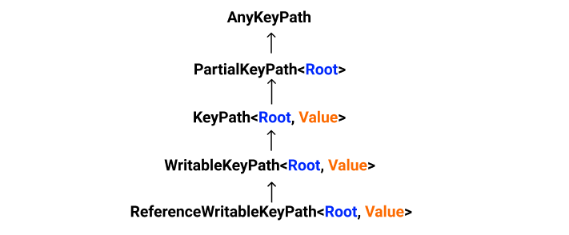

- [1 - What are Keypaths in swift](#1---what-are-keypaths-in-swift)
- [2 - Types of KeyPaths](#2---types-of-keypaths)
  - [2.1 ReferenceWritableKeyPath<Root, Value>](#21-referencewritablekeypathroot-value)
  - [2.2 WritableKeyPath<Root, Value>](#22-writablekeypathroot-value)
  - [2.3 KeyPath<Root, Value>](#23-keypathroot-value)
  - [2.4 PartialKeyPath<Root>](#24-partialkeypathroot)
  - [2.5 AnyKeyPath](#25-anykeypath)
- [3 - Swift 5.2: Key path as functions](#3---swift-52-key-path-as-functions)
- [4 - Using keyPaths](#4---using-keypaths)
- [See Also](#see-also)
- [Conclusion](#conclusion)


## 1 - What are Keypaths in swift

KeyPath is an object that stores a reference to a property of a type, that keyPath object allow us later on to get/set their underlying value ( defer/stash getter and setter evaluation when needed ) using subscript operator. you can then pass these keypaths objects around to create an API with shorter and cleaner syntax.

let's see with an example, suppose we have a class Person:

```swift
class User {
    var fullName: String
    var email: String?
    var age: Int
    
    init(fullName: String, email: String? = nil, age: Int) {
        self.fullName = fullName
        self.email = email
        self.age = age
    }
}
```

given the User we can then create a keyPath object for any instance property ( fullName, email, age ) of the User type and use that keyPath later on to get/set the property value on a specific user instance:

```swift
let user = User(fullName: "Mike", age: 16)
let fullNameKeyPath = \User.fullName
// get fullName value using fullNameKeyPath
print( user[keyPath: fullNameKeyPath] ) // Mike
// set fullName value using fullNameKeyPath
user[keyPath: fullNameKeyPath] = "John"
print( user[keyPath: fullNameKeyPath] ) // John
```

and as you can see, the keyPath expression have the form `\Root.path` and the KeyPath declaration is

```swift
class KeyPath<Root, Value> : PartialKeyPath<Root>
```

keyPath takes two generic types: `Root Type` ( User is the example ) and `Value Type` which is the Type of the property the keyPath refers to ( String in case fullName, Int for age, String? for email ).


> Note: at compile time, a key-path expression ( `\Root.path` ) is replaced by an instance of the keyPath class of the appropriate keyPath type ( we have 5 types of keypaths ) 

you can also make the keyPath expression nested or compound like,

```swift
class User {
   // ...
}
let user = User(fullName: "Mike", age: 16)
let fullNameEmptyKeyPath = \User.fullName.isEmpty
print(user[keyPath: fullNameEmptyKeyPath]) // false
```

or 

```swift
let user = User(fullName: "Mike", age: 16)
let fullNamePath = \User.fullName
let isEmptyPath = \String.isEmpty

let fullNameIsEmptyKeyPath = fullNamePath.appending(path: isEmptyPath) // merge the two paths
print( user[keyPath: fullNameIsEmptyKeyPath] ) // read keyPath value -> false
```

and here the keyPath `Root` type is `User` and the `Value` is `Bool` ( isEmpty is Bool ) so the fullNameIsEmptyKeyPath is of type  `KeyPath<User, Bool>`

## 2 - Types of KeyPaths

we have 5 types of keypaths represented by a hierarchy of 5 generic classes: `ReferenceWritableKeyPath` inherits from `WritableKeyPath` and `WritableKeyPath` inherits from `KeyPath` and so on.

> Note:  that hierarchy means ( for example ) if you have a function that takes `KeyPath<Root,Type>` as a parameter then you can pass also a keyPath of type `WritableKeyPath` and  `ReferenceWritableKeyPath` as a parameter to hat function because both of theme inherits from `KeyPath<Root,Type>`  but you cannot pass in a parameter of type `PartialKeyPath` or `AnyKeyPath`



let's explore the different keypaths types one by one and see when they can be used.


### 2.1 ReferenceWritableKeyPath<Root, Value>

`ReferenceWritableKeyPath` works with Root of reference types ( class ) and mutable properties ( var ), this allows to read and write ( change ) the property value.

This is the one we have seen already in the previous example, as the User is class/reference type and the fullName property is var

```swift
class User {
   var fullName: String
    var email: String?
    var age: Int
  // ...
}
let fullNameKeyPath = \User.fullName
print(type(of: fullNameKeyPath)) // ReferenceWritableKeyPath<User, String>
```

> Note: it doesn't matter wether the instance itself is var or let, what matters is the keyPath property should be mutable ( var ) to be able to change/write its value.

### 2.2 WritableKeyPath<Root, Value>

`WritableKeyPath` works will Root of value types ( struct and enum ) and again allow us to read/write the keyPath property value of an instance taking into account the property should be var and the instance should be var also.

```swift
struct User {
    var fullName: String
    var email: String?
    var age: Int
}
var user = User(fullName: "Mike", age: 16) // instance should be var
let ageKeyPath = \User.age
// get fullName
print(user[keyPath: ageKeyPath]) // 16 
// set fullName
user[keyPath: ageKeyPath] = 20
print(user[keyPath: ageKeyPath]) // 20

print(type(of: ageKeyPath)) // WritableKeyPath<User, Int>
```

### 2.3 KeyPath<Root, Value>

KeyPath is the simplest type, it can be used with both reference types ( classes ) and value types ( struct and enum ) as a `Root type`. it is used only for read property value ( read-only ) so it is only used for accessing immutable ( let ) properties.

```swift
struct User {  // or it can be -> class User 
    var fullName: String
    var email: String?
    let age: Int // Note: age is immutable
}
var user = User(fullName: "Mike", age: 16)
let ageKeyPath = \User.age
// get age
print(user[keyPath: ageKeyPath]) // 16
print(type(of: ageKeyPath)) // KeyPath<User, Int>
```

and if we tried changing the property value using the `ageKeyPath`.

```swift
user[keyPath: ageKeyPath] = 20  // error: cannot assign through subscript: 'ageKeyPath' is a read-only key path
```

### 2.4 PartialKeyPath<Root>

in the previous three keyPath types we know the two required types : the `Root type` ( User in our example ) and the `Value Type` ( String for fullName or Int for age ).  But if we don't know the `Value type` of our keyPath or we need to be more flexible about the value type then we can use the `PartialKeyPath<Root>` which takes a reference to a property of any `ValueType` from specific `Root type`. this is beneficial when we need to write a functions that accepts a KeyPaths of different Value types but the same Root Type or we need to store multiple keyPaths of different Value types in an array.

```swift
struct User {
    var fullName: String
    var email: String?
    let age: Int
}

var user = User(fullName: "Mike", email: "aaa@test.com", age: 16)

let agePartialKeyPath: PartialKeyPath<User> = \User.age
let emailPartialKeyPath: PartialKeyPath<User> = \User.email
let fullNamePartialKeyPath: PartialKeyPath<User> = \User.fullName

let keyPathsList: [PartialKeyPath<User>] = [agePartialKeyPath,emailPartialKeyPath,fullNamePartialKeyPath]
keyPathsList.forEach { keypath in
    print(user[keyPath: keypath]) // 16, Optional("aaa@test.com"), Mike
}
```

### 2.5 AnyKeyPath

AnyKeyPath is the least restrictive one. it is fully type erased keyPath that can be used when the `Root Type` is unknown and the `Value Type` ( Path) is also unknown. this is very beneficial when we want to create an API that takes a keyPath of different Root types or we want to store multiple KeyPaths of different Root Types in an array.

```swift
struct Cat {
    var name: String
}

class User {
   // ...
}

var user = User(fullName: "Mike", email: "aaa@test.com", age: 16)

let userAgeKeyPath = \User.age // ReferenceWritableKeyPath<User, Int>
let userEmailKeyPath = \User.email // ReferenceWritableKeyPath<User, Optional<String>>
let userFullNameKeyPath = \User.fullName // ReferenceWritableKeyPath<User, String>

var cat = Cat(name: "Nala")
let catNameKeyPath = \Cat.name // WritableKeyPath<Cat, String>

let keyPathsList: [AnyKeyPath] = [userAgeKeyPath,userEmailKeyPath,userFullNameKeyPath,catNameKeyPath]

keyPathsList.forEach { keypath in
    if let keypath = keypath as? PartialKeyPath<User> {
        print(user[keyPath: keypath]) // // 16, Optional("aaa@test.com"), Mike
    }else if let keypath = keypath as? PartialKeyPath<Cat> {
        print(cat[keyPath: keypath]) // Nala
    }
   
}
```

here we create keypaths of different Value types and different Root types then we store them in an array of type AnyKeyPath. 

since we are using AnyKeyPath we don't know any information about both the keypath Root type or the value Type and this is why we are trying to cast the `keypath` to `PartialKeyPath<User>` ( getter return Any ). we can for sure try to cast it to a more specific keypath like `KeyPath<Cat, String>` or `KeyPath<User, String>` and if the casting succeeds we know exactly both the `Root Type` and the `Value Type`.

let's recap,


|       KeyPath Type       | Read  | Write |                                           Note                                            |
| :----------------------: | :---: | :---- | :---------------------------------------------------------------------------------------: |
|        AnyKeyPath        |  Yes  | No    |                           unknown Root Type/ unknown Value Type                           |
|      PartialKeyPath      |  Yes  | No    |                           known Root Type / unknown Value Type                           |
|         KeyPath          |  Yes  | No    |                            known Root Type / known Value Type                             |
|     WritableKeyPath      |  Yes  | Yes   | known Root Type / known Value Type for value types ( struct and enum ) ( var instance ) |
| ReferenceWritableKeyPath |  Yes  | Yes   |         known Root Type / known Value Type, for class Type ( let or var instance)         |


## 3 - Swift 5.2: Key path as functions

Because closures of the form: `(Root Type ) -> Value` are common in Swift, Key path as functions is one of the features added to swift 5.2. it allows keypath to automatically be promoted and used wherever a functions of the form  `(Root ) -> Value` are expected.

let's assume we have a list of users and we need to extract their full names,

```swift
struct User {
    var fullName: String
    var email: String?
    var age: Int
}

var firstUser = User(fullName: "Mike", email: "mike@test.com", age: 20)
var secondUser = User(fullName: "Adam", email: "adam@test.com", age: 25)
var ThirdUser = User(fullName: "John", email: "jogn@test.com", age: 30)
var users = [firstUser,secondUser,ThirdUser]

let usersNames = users.map { $0.fullName } // original
print(usersNames) // ["Mike", "Adam", "John"]
```

here we are passing to the map a function of the form `( User ) -> String` return the users full names, in swift 5.2 we can instead pass a keypath for the user fullName property and pass it to the map.

```swift
let usersNames = users.map (\.fullName) // using keypath
print(usersNames)  // ["Mike", "Adam", "John"]
```

or 

```swift
let fullNameKeyPath: (User) -> String = \User.fullName
let usersNames = users.map ( fullNameKeyPath )
print(usersNames)
```

but this way we need to be explicit about the keypath type `let fullNameKeyPath: (User) -> String`, because `let fullNameKeyPath = \User.fullName` is inferred as a keypath object not as a function ( default behavior ). by making the type explicit we are using the `fullNameKeyPath` as a function not as a keypath object.

```swift
let fullNameKeyPath = \User.fullName // inferred as WritableKeyPath<User, String>
let usersNames = users.map ( fullNameKeyPath ) // Error
print(usersNames)
```

## 4 - Using keyPaths

keypaths can be used on collection types to create generic algorithms and APIs with shorter and cleaner syntax. for instance let's say we want to sort an array containing elements of any Type and sort it by a specific property. with keypaths,

```swift
extension Sequence {
    func sorted<T: Comparable>(by keyPath: KeyPath<Element, T>) -> [Element] {
        return sorted { a, b in
            return a[keyPath: keyPath] < b[keyPath: keyPath]  // read
        }
    }
}

var firstUser = User(fullName: "Mike", email: "mike@test.com", age: 20)
var secondUser = User(fullName: "Adam", email: "adam@test.com", age: 25)
var ThirdUser = User(fullName: "John", email: "john@test.com", age: 30)
var users = [firstUser,secondUser,ThirdUser]

print( users.sorted(by: \.fullName))
// [User(fullName: "Adam", email: Optional("adam@test.com"), age: 25),
// User(fullName: "John", email: Optional("john@test.com"), age: 30),
// User(fullName: "Mike", email: Optional("mike@test.com"), age: 20)]
print( ["C","D","AB","A"].sorted(by: \.self) ) // ["A", "AB", "C", "D"]
print( ["C","D","AB","A"].sorted(by: \.count) ) // ["C", "D", "A", "AB"]
```

here we created an `extension` to the `Sequence` type, adding a new `sorted(by keyPath:)` that takes a keypath to sort the array based on that keypath value, so we can sort array of users by fullName, email, age or sort any array based on any Comparable property. 

another example could be if we want to update a UILabel properties in a shorter syntax, we can do something like:

```swift
protocol Builder {}

extension Builder {
     func set<T>(_ keyPath:ReferenceWritableKeyPath<Self, T>,to newValue: T) -> Self {
        self[keyPath: keyPath] = newValue  // change property value
        return self
    }
}

extension UILabel: Builder { }

let label = UILabel()
    .set(\.text, to: "Hello world")
    .set(\.textColor, to: .red)
    .set(\.font, to: .systemFont(ofSize: 24, weight: .medium))
```

> if you want to apply this to any `UIKit` component, just make it conform to the Builder protocol just like we did with the `UILabel` like extension `extension UIButton: Builder { }`. but if we want to use this on any NSObject or any UIKit element then we can instead make the NSObject conforms to the Builder protocol `extension NSObject: Builder { }`. 
 
as you can see, keypaths enable us to create many APIs with shorter syntax like creating DSL for working with layout constraints, algorithms on collections types and many other use cases.

## See Also

- [KeyPathKit](https://github.com/vincent-pradeilles/KeyPathKit)  provides many functions to manipulate data with syntax that relies on keypaths to make the call shorter and cleaner.
- [KeyPaths in Swift]( https://appventure.me/guides/keypaths/complete_book.html)
- [The Underestimated Power of Keypaths - Swift Heroes 2019](https://www.youtube.com/watch?v=p76XTTTDUlU)
- [Smart KeyPaths: Better Key-Value Coding for Swift proposal](https://github.com/apple/swift-evolution/blob/master/proposals/0161-key-paths.md)
- [Key Path Expressions as Functions Proposal](https://github.com/apple/swift-evolution/blob/master/proposals/0249-key-path-literal-function-expressions.md)

## Conclusion

keypaths introduced in Swift 4 to overcome the old `#keyPath()` syntax limitations available in Swift 3. As you might know \#keyPath() is represented using a String which has a number of limitations.

- `#keyPath()` works only with NSObjects 
- loss of type information, we don't know which type ( String,Int, ...etc ) the keypath refers to

KeyPaths are great and type safe as compared to the old \#keyPath(), allow us to create a generic algorithms and APIs that are shorter and cleaner. keypaths are also used in SwiftUI and Combine framework in several places to keep the API concise.


If you think i missed anything, let me know and feel free to share with me any thoughts or feedback you have.

Thanks for reading!🚀
